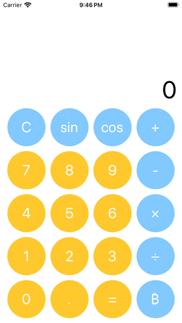

# Calculator app

This is an implementation of the calculator app for the given app assigment requirements.
To ensure the app's scalability, testability and modularization I went with MVVM architecture which is usually my default choice and I feel the most comfortable in. Looking at the attached gif I think that UX wise what this app needs the most right now is higlighting of the touched buttons and currently chosen operation.

## Design
The app design is strongly influenced by the iPhone's default Calculator app and real life calculators. I tried to mimick both visual appearance and apps' behavior, with some adjustments to meet the assignment's requirements

This calculator has an 5x4 button matrix for input and operations. This gives us 7 slots for the calculation operations. They are defined by the `CalculatorOperation` protocol, which allows async data fetching (which I assumed would come in handy for the required Bitcoin operation). When an operation is calculating an activity indicator is visible in place of calculator's display. The `CalculatorOperations` have been created in a separate local package.

The `BitcoinPriceProvider` protocol / implementation handles the Bitcoin operation. I used an API found in a google search. `CalculatorProviders` are currently a part of the `CalculatorOperations` package, but I feel like they could be moved to a separate library to better express the apps dependencies / layers.

`CalculatorViewModel` is responsible for setting up the buttons' view models based on given operations, so this gives the code a lot of flexibility in changing the operations that are visible for the user, as well as defining new ones. This class is also responsible for most of the calculator logic. It currently supports 1 and 2 argument operators, and as mentioned before up to 7 operations. I feel like the logic could be cleaned up a little, but I tried to be as clean as possible given the time constraints that I had. Maybe it should also be concidered to divide the VM into some smaller pieces.

The app supports dark and light mode color schemes. The colors are defined in Assets and accessed through `Colors`enum. Only portrait mode is supported for now. I felt that a proper landscape mode would require a lot more work, and some extra operations for the user (like in the iPhone's calculator)
 
Error handling has also been implemented, the errors come from calculator's operations and are displayed in a user-friendly way on a banner at the top of the screen. Also the display goes to an "Err" state - to clear the error user is asked to press the "C" button, which I thought was a smart way to imitate how real caltulator work.

## Things I would like to do next if I had more time:

- larger screens still should use some tuning, but my intention was to make this layout as universal as possible (for portrait mode that is)

- highlighting of the touched buttons and currently selected calculator operation

- limit calculator display's max chars and approach the displayed accuracy accordingly with right string formatting (currently it's just casting `Float` to `String`)

- Move Error descriptions to localized strings (marked with TODO in code)

- Move error handling to separate view container + view model to lighten up the CalculatorViewModel and make error handling more reusable

- Separate the view and view model layers by putting them in separate packages / modules, which would require defining protocols for their respective view models, and the view model package would be an implementation of them. This would probably make previews run faster with mocked content

- Unit testing - the code has been created in a manner where almost every part can be unit tested separately - that involves testing calculator logic through view models (with mocking and / or using real calculation operations), calculation operations, providers. So the only thing left is to write those tests ;)

- Horizontal mode? - this would require some design thinking, I would personally go in a direction that the Apple calculator does, with much more operations being presented so that the app is more usable and the view makes sense. This most definitely exceeds the 8 hours I had for this assignment, so I made a design decision not to support horizontal for now.

- Firebase support as stated in optional requirements - there's already a wrapper for logging events in the project, so that should be fairly easy, but requires configuring firebase etc, so I skipped this part

- The CI piplines - once again, this would require some configuration and trial testing, so didn't fit the time frame. I would personally use Bitrise for this because I'm familiar with it
